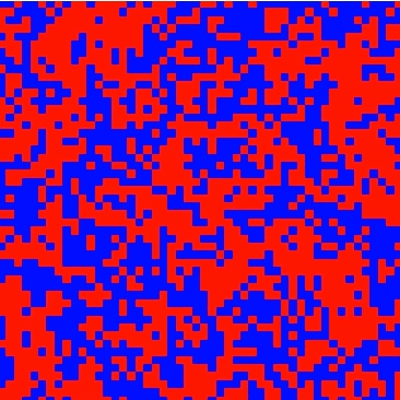
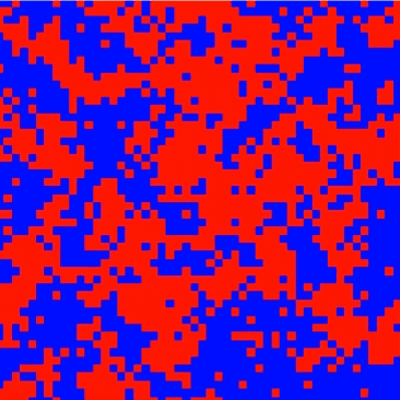

# Simulating the Ising Model

## NOTE

This GitHub repository is still under construction. The MCMC simulation of the 2D classical Ising model can be found in notebooks/rough.ipynb. This notebook is effectively a digital scratchpad and is very messy. Nonetheless, it contains

* An exact solution of the 1D Ising model using the transfer matrix using its description found in [^1]
* A mean field approximation of the 2D Ising model, albeit, in it's current stage, not fully justified. Will improve on this very soon. This follows the discussion [^2]
* Applying the Metropolis-Hasting algorithm to generate a representative sample of configurations of the Ising model following the discussion found in [^3]

However, there are details which I will expand upon as I work on the repository. These include:
* A more formal justification of MFT via the Bogoliubv inequality instead of immediately replacing the the individuals spins with the average magnetic moment per unit volume
* A more detailed explanation of detailed balance and why that leads us to the probabilities of accepting a transition in the Metropolis-Hastings algorithm

Moreover, if you would like to visualise how states are able align at low temperatures, beating out thermal chaos, you can compare the mp4s in ./animations. Alternatively you can view the following GIFs. The first is system evolution under Metropolis at a temeperature far above the critical temperature:

where red indicates spin and blue indicates spin down. You can see that no macroscopic domain walls form. On the other hand, at temperatures below the critical temperature:

you can see domain walls form quickly and a macroscopic, total magnetisation is achieved.

## Sources

[^1]: Folk, R et al. (2024). "Ising's roots and transfer-matrix eigenvalues." 6-9.

[^2]: Sakthivadivel, D. A. R. (2025). "Magnetisation and the Mean Field Theory in the Ising Model". Sections II and III.

[^3]: Robert C.P. (2016). "The Metropolis-Hastings algorithm".  Sections II and III.